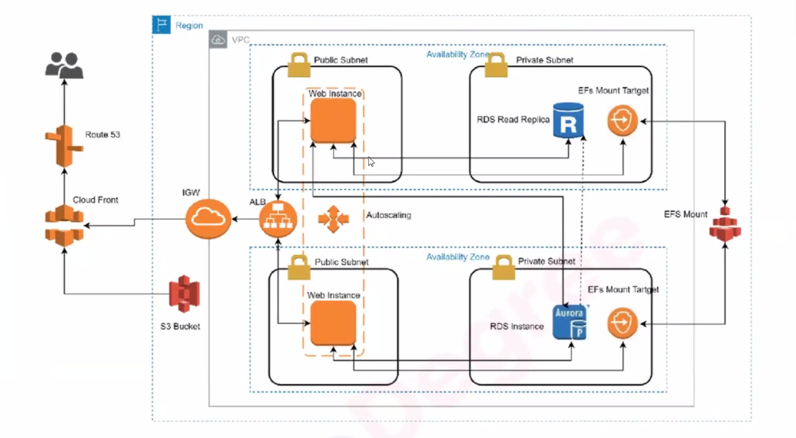
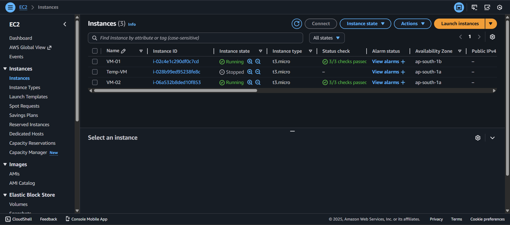
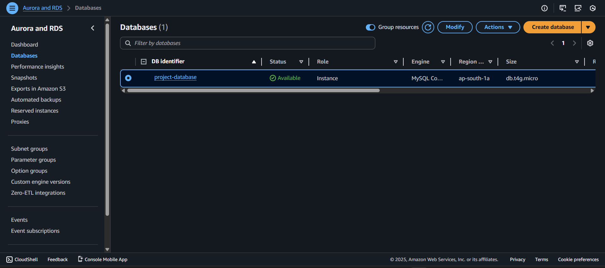
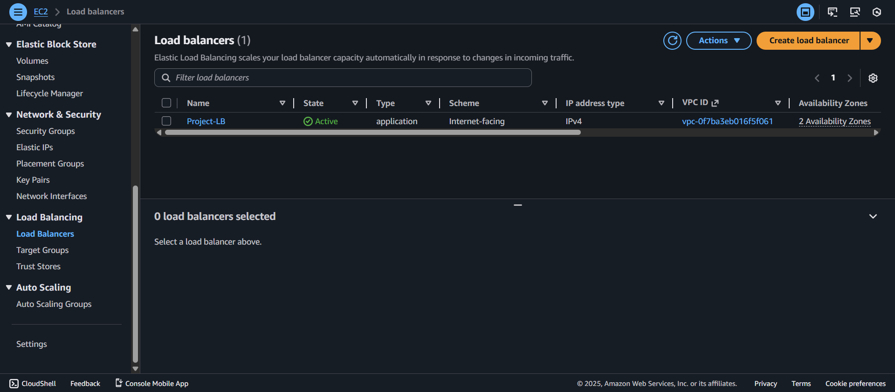

# Scalable and Highly Available Web Application using AWS Cloud Services

## 📝 Project Overview
This project demonstrates how to design and deploy a secure, fault-tolerant **two-tier web application architecture** using **AWS Free Tier** services.  
It includes a public-facing web tier and a private database tier inside a Virtual Private Cloud (VPC).

---

## ☁️ AWS Services Used
- **VPC** – Custom network with public and private subnets across Availability Zones.  
- **EC2** – Web servers hosting the application, connected via an Application Load Balancer.  
- **RDS (MySQL)** – Managed relational database hosted in the private subnet.  
- **EFS** – Shared file system accessible by EC2 instances.  
- **Route 53** – Domain routing to the Application Load Balancer.  
- **CloudWatch & CloudTrail** – Monitoring, logging, and auditing services.  
- **S3** – Used for static content hosting.  

---

## 🧱 Architecture Diagram

---

## 🚀 Deployment Steps
1. Created a **VPC** with public and private subnets in two Availability Zones.  
2. Launched **EC2 instances** in public subnets and installed Apache web server.  
3. Configured **RDS MySQL** instance in private subnet for database storage.  
4. Attached **EFS** for shared storage across EC2s.  
5. Configured **Application Load Balancer (ALB)** and linked domain via **Route 53**.  
6. Monitored resources using **CloudWatch** and tracked user actions via **CloudTrail**.  

---

## 📸 Screenshots
| Service | Screenshot |
|----------|-------------|
| EC2 Instances |  |
| RDS Instance |  |
| Load Balancer |  |
| Route 53 Domain |  |
| CloudWatch Dashboard |  |

---

## 🧠 Key Learnings
- Gained hands-on experience in deploying a two-tier architecture on AWS.  
- Understood core AWS services (VPC, EC2, RDS, ALB, EFS, Route 53).  
- Implemented monitoring and logging for better observability.  
- Learned how to manage cost-efficient cloud setups using Free Tier.

---
